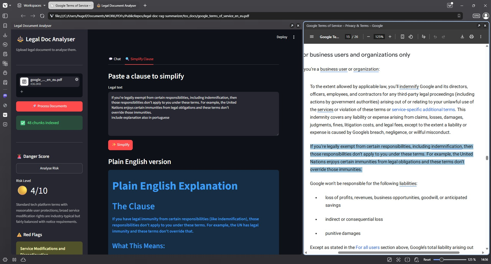
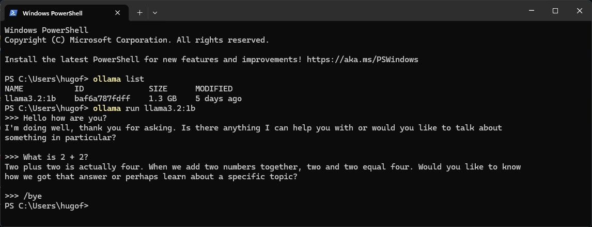
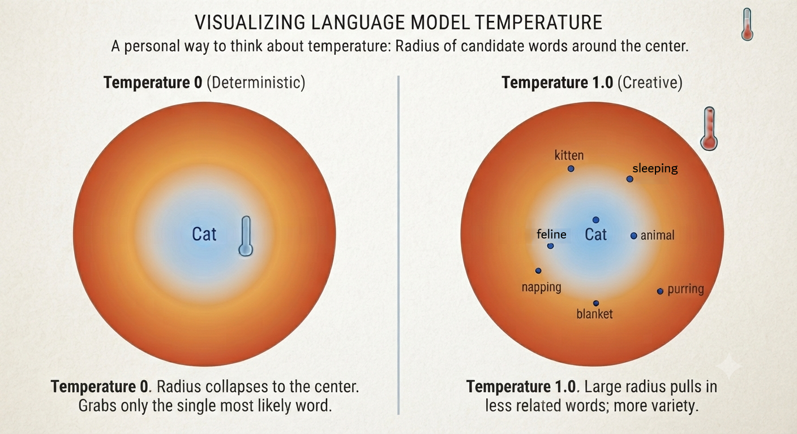
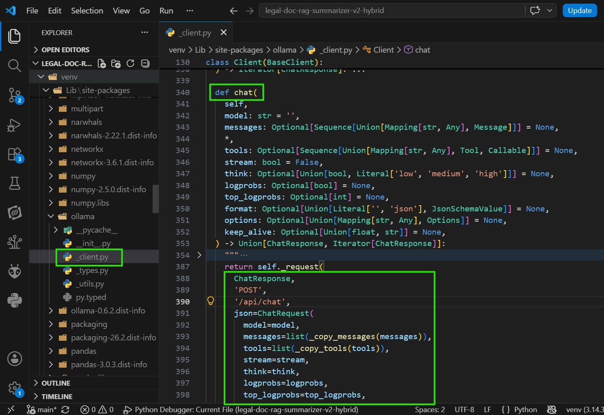
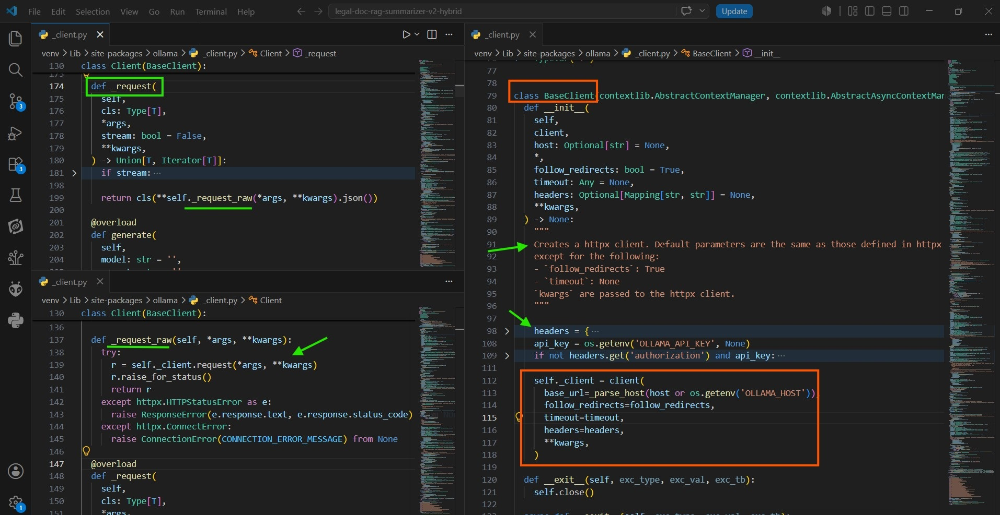
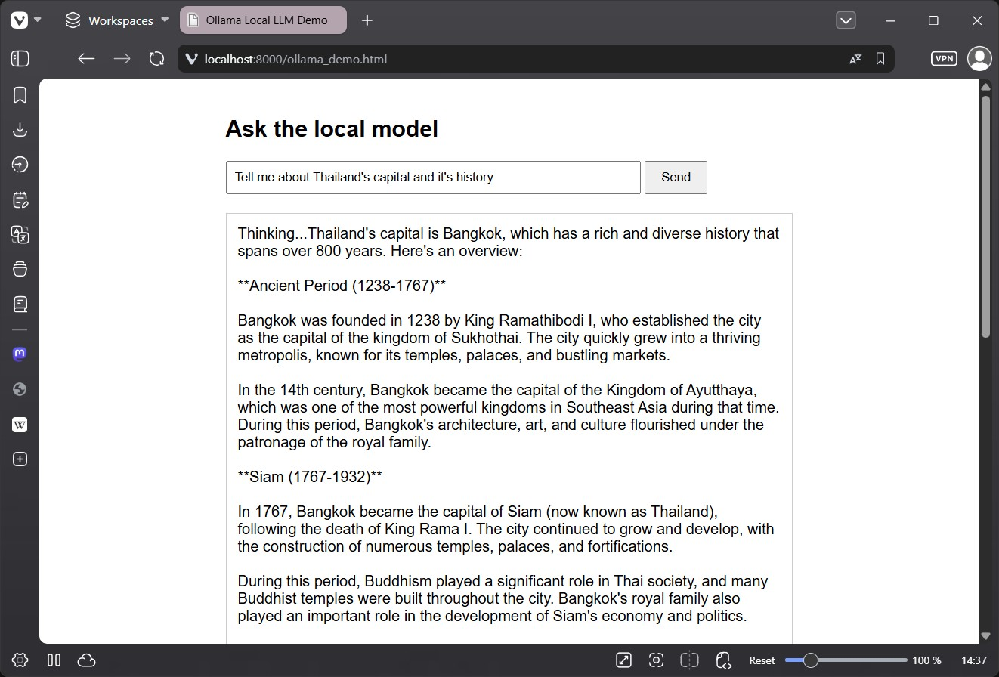
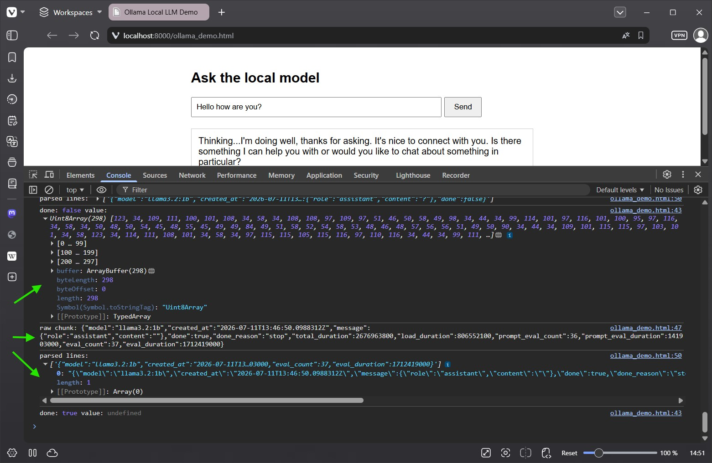

# legal-doc-rag-summarizer-v2-hybrid

> A hands on RAG tutorial for legal document analysis: this time going hybrid, pairing a local LLM with Claude.

🗓️ **Status: July 2026**

---

## Picture this

TODO: narrative intro, to be written together. Suggest a short scenario the reader can relate to (a wall of legal text, no easy way through it).



---

⚠️ **Heads up**

This is a personal learning project, not an official Anthropic resource.
It may contain errors, simplifications, or opinionated choices made for clarity over correctness.
Think of it as a **hands on RAG tutorial**: each part builds on the previous one, so you always know why the next step exists.

Before you dive in, keep a few things in mind:

1. **Fast Paced AI Evolution:** the AI landscape moves fast. Specific libraries or model names may change, but the RAG concepts taught here stay relevant.
2. **Not production ready:** this project was built to learn and teach. It has not been tested or hardened for production use.
3. **Built with AI Assistance:** this README was written with AI help, mainly for English refinement. The architecture, curriculum, and all technical decisions are my own.

This project is a sequel to [legal doc rag summarizer](https://github.com/hasff/legal-doc-rag-summarizer), which covered the fundamentals: chunking, embeddings, BM25, hybrid retrieval, danger score, and a Streamlit wrap up. This v2 picks up where that one left off and asks a new question: what happens when part of the pipeline runs locally instead of calling Claude for everything?

TODO: inspiration video credit.

---

# Key Concepts Demonstrated

✅ Merging CLI and Streamlit into a single entry point
<br>✅ Running a local LLM (llama3.2:1b) via Ollama
<br>✅ Spotting the limits of a small local model on generation tasks
<br>✅ Single responsibility routing with is_legal_question
<br>✅ Calling Ollama three ways: CLI, Python module, raw HTTP
<br>✅ Calling Ollama directly over HTTP, from Python and from the browser
<br>✅ Packaging a prompt and parameters into a custom Modelfile

<a name="table-of-contents_"></a>

---

## Table of Contents

- [What is this project about?](#what-is-rag_)
- [Project Architecture](#project-architecture_)
- [Requirements](#requirements_)
- [Setup](#setup_)
- [Project Structure](#project-structure_)
- [Part 01 - Introduction: Merging CLI and Streamlit](#part-1)
- [Part 02 - Going Local with Ollama](#part-2)
- [Part 03 - Local First, Claude When Needed](#part-3)
- [Part 04 - Three Ways to Call Ollama](#part-4)
- [Part 05 - From Python to the Browser](#part-5)
- [Part 06 - Baking It Into a Modelfile](#part-6)
- [Next Steps & Resources](#next-steps--resources_)
- [Get in Touch](#get-in-touch_)

<a name="what-is-rag_"></a>

---

## What is this project about?

#### ⚡ Quick Navigation: [⬅️ Table of Contents](#table-of-contents_) | [Project Architecture ➡️](#project-architecture_)

This project has two audiences in mind.

**🔁 Coming from v1?**

You already have a working RAG pipeline (from [legal-doc-rag-summarizer](https://github.com/hasff/legal-doc-rag-summarizer)) that extracts text from a PDF, chunks it, searches it with vector and BM25 retrieval, and uses Claude for a danger score, a Q&A flow, and a clause simplifier. This sequel takes that pipeline and asks: 
- Could part of this run on a small local model instead, and where does that stop making sense?


**🆕 Starting here?**

Welcome. This project starts from an already working [legal document assistant](https://github.com/hasff/legal-doc-rag-summarizer) (the app you'll find in Part 01, `app_v9.py`) that gives a danger score, answers questions, and simplifies clauses using Claude. From there, you'll add a local model (llama3.2:1b, via Ollama), compare it against Claude, and end up with a hybrid system: the local model handles quick classification tasks, Claude handles the tasks that need strong reasoning.

<br>

> ⚠️ As mentioned earlier in this README, this is a learning project, not production ready software. It is meant to give you a hands on, working mental model of how hybrid RAG systems are actually built.

[↑ Back to Table of Contents](#table-of-contents_)

<a name="project-architecture_"></a>

---

## Project Architecture

#### ⚡ Quick Navigation: [⬅️ What is this project about?](#what-is-rag_) | [Requirements ➡️](#requirements_)

At its core, this project answers one question for every user message: does this need Claude, or can the local model handle it?

```text
User question
     │
     ▼
is_legal_question (Ollama, llama3.2:1b)
     │
     ├── false → rejected locally, Claude is never called
     │
     └── true
          │
          ▼
     RAG retrieval (vector + BM25, combined with RRF)
          │
          ▼
     Claude (danger score / Q&A / clause simplifier)
```

The local model only ever makes one decision: is this in scope. Everything downstream, retrieval and generation, stays exactly as it was in v1. Claude is still the one reading the document and writing the answer, the local model just decides whether it's worth asking.

This is also why Part 03 to Part 06 exist: getting that single decision to be fast, cheap, and reproducible turns out to need more care than it looks like at first.

[↑ Back to Table of Contents](#table-of-contents_)

<a name="requirements_"></a>

---

## Requirements

#### ⚡ Quick Navigation: [⬅️ Project Architecture](#project-architecture_) | [Setup ➡️](#setup_)

- Python 3.10+
- [Ollama](https://ollama.com) installed, with the `llama3.2:1b` model pulled

[↑ Back to Table of Contents](#table-of-contents_)

<a name="setup_"></a>

---

## Setup

#### ⚡ Quick Navigation: [⬅️ Requirements](#requirements_) | [Project Structure ➡️](#project-structure_)

### 1. Clone the repository

```bash
git clone https://github.com/hasff/legal-doc-rag-summarizer-v2-hybrid.git
cd legal-doc-rag-summarizer-v2-hybrid
```

### 2. Create a virtual environment

```bash
# Windows
py -m venv venv

# macOS / Linux
python -m venv venv
```

```bash
# Windows
venv\Scripts\activate

# macOS / Linux
source venv/bin/activate
```

### 3. Install dependencies

```bash
pip install -r requirements.txt
```

### 4. Configure environment variables

```bash
cp .env.example .env
```

Add your Anthropic API key to `.env`:

```
ANTHROPIC_API_KEY="your_key_here"
```

> ⚠️ Never commit your .env file. Add it to .gitignore.

[↑ Back to Table of Contents](#table-of-contents_)

<a name="project-structure_"></a>

---

## Project Structure

#### ⚡ Quick Navigation: [⬅️ Setup](#setup_) | [Part 01 ➡️](#part-1)

```
legal-doc-rag-summarizer-v2-hybrid/
├── .env.example
├── .gitignore
├── README.md
├── requirements.txt
│
├── app_v9.py                          ← Part 01: merging CLI and Streamlit
├── app_v10.py                         ← Part 02: local LLM baseline
├── app_v11.py                         ← Part 03: check_relation routing guard
├── test_prompt.py                     ← Part 03: isolated prompt testing
├── app_v12.py                         ← Part 04: three ways to call Ollama
├── ollama_demo.html                   ← Part 05: browser demo
├── streaming_demo.py                  ← Part 05: streaming in Python, two ways
├── ModelFile_TEST                     ← Part 06: throwaway MushroomBOT model
├── ModelFile_LEGAL_DOCS_CLASSIFIER    ← Part 06: production classifier model
├── app_v13.py                         ← Part 06: wiring the classifier model in
│
└── tos_docs/                          ← place your PDF files here (git ignored)
```

[↑ Back to Table of Contents](#table-of-contents_)

<a name="part-1"></a>

---

# Part 01 - Introduction: Merging CLI and Streamlit

#### ⚡ Quick Navigation: [⬅️ Project Structure](#project-structure_) | [Part 02 ➡️](#part-2)

> 📒 **What you'll learn:** how to merge a CLI test entry point and a Streamlit UI into a single file, and when `st.cache_resource` should (and should not) be used.

---

### Theory

**🔁 Coming from v1?** <br>
If you came from the first tutorial, you had `app_v7.py`, which had a `__main__` block for testing, and `app_v8.py`, which wrapped everything in a Streamlit UI without that test block. `app_v9.py` merges the two: one file that can run as a CLI test, or as a Streamlit app, depending on how it is launched.

**🆕 Starting here?** <br>
If you are new here: this app answers questions about a legal document, gives it a danger score, and rewrites confusing clauses in plain English. Part 01 is about the plumbing that lets you test that logic from the terminal and serve it through a Streamlit App, without duplicating code.

> 💡 Why one file instead of a separate `rag_core.py` module? More on that in the Code Walkthrough below.

---

### Code walkthrough

> 📄 **File:** `app_v9.py`

> ⚠️ Make sure you've installed the requirements and added your Anthropic API key to `.env`, as covered in [Setup ⬆️](#setup_). Without it, the Claude calls in this file won't work.

Note: `app_v9.py` is the result of merging `app_v7.py` and `app_v8.py`.

Before merging, `app_v7.py` had its own `__main__` block for CLI testing, and `app_v8.py` wrapped the same RAG logic in a Streamlit UI. <br>
The problem: Streamlit apps also run through `__main__`, so simply combining both files meant launching Streamlit would unintentionally trigger the CLI test block too.

`app_v9.py` solves this by merging both entry points into one file, while keeping the underlying RAG core untouched. The key decision is detecting whether the script is running inside the Streamlit server, using `streamlit.runtime.exists()`. When it returns `False`, the script runs in CLI test mode. When it returns `True`, it runs the Streamlit UI.

```python
# ─────────────────────────────────────────────
# 🚀 ENTRY POINT - RUN
# ─────────────────────────────────────────────
# `python app_v9.py`      -> runs CLI tests (like the old app_v7.py)
# `streamlit run app_v9.py` -> runs the Streamlit UI (like the old app_v8.py)
# streamlit.runtime.exists() tells these two cases apart, since Streamlit
# also sets __name__ == "__main__" internally.
if __name__ == "__main__":
    if st_runtime_exists(): # alias for streamlit.runtime.exists()
        run_streamlit_app() 
    else:
        run_cli_tests()
```

Where:
- `run_streamlit_app()`: runs all the logic related to streamlit 
- `run_cli_tests()`: runs the CLI tests

<br>

There's also another important adjustment.

**🔁 Coming from v1?** <br>
Back in `app_v8.py`, every Streamlit rerun reloaded the embeddings model from scratch. It wasn't a big deal then. We just wanted to see it working, so a bit of reload overhead went unnoticed. Here in `app_v9.py`, `@st.cache_resource` is introduced to fix that. The model now loads once and survives reruns.

**🆕 Starting here?** <br> 
Heavy, reusable resources such as the SentenceTransformer embeddings model are loaded through a function decorated with `@st.cache_resource`.


```python
@st.cache_resource
def get_embeddings_model():
    return SentenceTransformer("...")
```

Streamlit reruns the whole script on every interaction. Without caching, that would mean reloading model weights on every click, slow and unnecessary. `st.cache_resource` makes sure the model is created once per process and shared across sessions.

In practice, this means any function that needs the model just calls `get_embeddings_model()` again. Streamlit's caching returns the same instance instead of recreating it.

```python
def embed_texts(texts: list[str]) -> list[list[float]]:
    return get_embeddings_model().encode(texts).tolist()

def embed_query(query: str) -> list[float]:
    return get_embeddings_model().encode([query]).tolist()[0]
```

Worth noting: `st.cache_resource` works correctly even outside the Streamlit runtime, in plain CLI mode. So there is no need for conditional logic around `st_runtime_exists()` just to decide how the model gets loaded. The same cached function serves both modes.

The working rule used throughout this project:

| Kind of data | Where it lives |
|---|---|
| Heavy resources shared by everyone (models, clients) | `st.cache_resource` |
| Data generated from a specific user's input in a session (chunks, embeddings, BM25 index) | `st.session_state` |

> 💡 **A more honest architecture**
>
> The ideal setup would separate the core logic (chunking, embeddings, retrieval, Claude calls) into its own module, for example `rag_core.py`, with thin CLI and Streamlit files that just import from it. That respects separation of concerns and scales better for a real project.
>
> This tutorial deliberately keeps a single file per part instead, mainly so readers coming from v1 can follow the same one file per part pattern they already know. It is a conscious pedagogical tradeoff, not a claim that this is the "correct" way to structure a real app.

[⬆️ **`Part 1`**](#part-1)

---

### Run it

> On macOS / Linux, replace `py` with `python` or `python3`.

```bash
# CLI test mode
py app_v9.py

# Streamlit UI mode
streamlit run app_v9.py
```

Running the CLI mode loads the embeddings model once, then walks through the test cases: a danger score with summary, an `answer_question` call, and a `simplify_clause` call. Example output:

```bash
Score: 2
Summary: This is a synthetic test document designed to stress test retrieval systems...
===> answer_question
question: What the document is about?
answer: Based on the excerpts provided, this document is a synthetic legal document created for testing purposes only...
===> simplify_clause
clause: 3.3 Real Estate Agent Obligations...
answer: Plain English Version of Section 3.3...
```

Running `streamlit run app_v9.py` instead opens the same logic in a browser UI.


*app_v9.py running in Streamlit UI mode*

> Note: you'll notice the danger score differs slightly between the CLI run and the screenshot above (2 vs 3). LLMs are not deterministic, so small variations between runs are expected, even with the same input.

---

### Conclusions

`app_v9.py` merges the CLI test file and the Streamlit UI into one, using `streamlit.runtime.exists()` to tell the two run modes apart without conflicting `__main__` blocks. The RAG core itself didn't change.

We also introduced `@st.cache_resource`, which turned out to work the same whether the file runs as CLI or as Streamlit, so no extra conditional logic was needed there.

From here, we're ready to see how to run a local LLM and replace the Claude calls entirely. Is it worth the trouble? Let's see in the next part 👇.

---

> 💡 **Curiosity:** `llama3.2:1b` has around 1 billion parameters, small enough to run on a laptop CPU. For comparison, that is roughly 100 to 400 times smaller than most frontier cloud models. It is a useful reminder that "small" local models trade raw capability for speed and privacy, which is exactly the tension this project explores.

[↑ Back to Table of Contents](#table-of-contents_)

<a name="part-2"></a>

---

# Part 02 - Going Local with Ollama

#### ⚡ Quick Navigation: [⬅️ Part 01](#part-1) | [Part 03 ➡️](#part-3)

> 📒 **What you'll learn:** how to call a local model through Ollama, and why that matters before building any routing logic on top of it.

---

### Theory

Before building anything clever, Part 02 sets a baseline: `ask_llm` calls `ask_local_llm`, which talks to `llama3.2:1b` through Ollama, directly, with no routing and no fallback to Claude. The point is to see, honestly, what a small local model can and cannot do on its own.

Ollama is a tool that runs open weight LLMs on your own machine. It handles downloading the model, loading it into memory, and exposing a local API you can call from code, no cloud, no API key, no internet required once the model is downloaded.

### Watch this 7 minute video from IBM - What is Ollama? Running Local LLMs Made Simple
[](https://youtu.be/5RIOQuHOihY)

---

### Install Ollama

Before running any code, you'll need Ollama installed on your machine.

1. Go to [ollama.com](https://ollama.com) and download the installer for your OS and install it.
2. Open a terminal and pull the model:

```bash
ollama pull llama3.2:1b
```

**About the name:** `llama3.2` is the model family and version. The `1b` means 1 billion parameters, one of the smallest models Ollama offers, small enough to run on a laptop CPU with no dedicated GPU.

3. Confirm the model is installed:

```bash
ollama list
```

4. Run it directly from the terminal:

```bash
ollama run llama3.2:1b
```

This drops you into an interactive chat with the model. Type `/bye` to exit.

**Try it:** ask something simple like `Hello, who are you?` or `What is 2 + 2?` to confirm it responds.



---

### Install dependencies

> 💡 This part introduces `ollama`. If you already ran `pip install -r requirements.txt`, you have it. If not:

```bash
pip install ollama
```

- `ollama` - the Python client used to talk to your local Ollama server.

[⬆️ **`Part 2`**](#part-2)

---

### Code walkthrough

> 📄 **File:** `app_v10.py`

In `app_v9.py`, every call to Claude went straight through one function:

```python
def ask_claude(system: str, query: str, prefill=False) -> str:
```

Now we introduce a local model as an alternative to Claude.

Let's see how we call it:

```python
# Ollama
import ollama
...
OLLAMA_MODEL = "llama3.2:1b"
...
def ask_local_llm(system: str, query: str, prefill=False) -> str:
    print("🤖📍 Local LLM here, happy to answer!")
    msgs = [
        {"role": "system", "content": system},
        {"role": "user", "content": query},
    ]
    response = ollama.chat(
        model=OLLAMA_MODEL,
        messages=msgs,
        format="json" if prefill else None, # 🎯
    )
    return response["message"]["content"]
```

This function uses the `ollama` module instead of the Claude SDK. It also forces a JSON response differently: instead of an assistant prefill starting with `{` 🏹👇, it uses the `format` 🎯👆 parameter.

> 🪶 Remember:
>```python
>def ask_claude(system: str, query: str, prefill= False) -> str:
> 
>   print("🤖🌐 Claude here - happy to answer!")
> 
>   msgs = [{"role": "user", "content": query}]
> 
>   # put words in claude's mouth
>   # to force claude to return json since it "thinks" it already started writing json
>   if prefill:
>       msgs.append({"role": "assistant", "content": "{"}) # 🏹
> ```

<br>

Next we need a strategy to swap models easily. Since `ask_claude` and `ask_local_llm` share the same signature, we can create an intermediate function that calls one or the other explicitly:

```python
def ask_llm(system: str, query: str, prefill=False) -> str:
    # return ask_claude(system, query, prefill)
    return ask_local_llm(system, query, prefill)
```

From now on, every place in the code that needs an LLM calls `ask_llm` instead of `ask_claude` or `ask_local_llm` directly. Switching between Claude and local is now a one line change.

Here is one of those call sites, unchanged apart from the function name:

```python
# 🤖── LLM calls - actions ────────────────────────────────────────────────────
def compute_danger_score(chunks: list[str]) -> dict:
    sample = "\n\n---\n\n".join(chunks[:20])
    prompt = f"""..."""
    # raw = ask_claude(SYSTEM_CONTRACT, prompt, True)   # BEFORE
    raw = ask_llm(SYSTEM_CONTRACT, prompt, True)        # AFTER
```

---

### How the tests are wired

If you are new to this project, `run_cli_tests()` is the entry point when you run the file from the CLI. It loads a sample PDF, builds the chunks, embeddings, and BM25 index, then runs three tests in sequence:

```python
file_path = PDFS_DIR / "danger_zone_rag_test.pdf"

pdf_text = extract_text_from_pdf(file_path)
pdf_text_chunks = chunk_text(pdf_text)

chunks_embeddings = embed_texts(pdf_text_chunks)
chunks_tokens = tokenize_texts(pdf_text_chunks)
bm25 = build_bm25_index(chunks_tokens)

# 1)
_test_compute_danger_score(pdf_text_chunks)

# 2)
question = "What the document is about?"
_test_answer_question(question, pdf_text_chunks, chunks_embeddings, bm25)

# 3)
clause = """3.3 Real Estate Agent Obligations
Licensed real estate agents must act in the best interest of their client throughout the property
transaction lifecycle. Agents are prohibited from representing conflicting interests in the same
transaction without written disclosure and informed consent from both parties. Commission
structures must be disclosed prior to engagement (Disclosure Form: REA-DISC-2024). Agents must"""
_test_simplify_clause(clause, pdf_text_chunks, chunks_embeddings, bm25)
```

Each numbered call tests one of the LLM functions we just saw: the danger score, a free form question, and a clause simplification.

[⬆️ **`Part 2`**](#part-2)

---

### Run it

> ⚠️ **Before running this** 🦙
>
> Ollama needs to be running in the background for any code that calls the local model. If it's not, you'll get a `ConnectionError` like this:
>
> ```
> ConnectionError: Failed to connect to Ollama. Please check that Ollama is downloaded, running 
> and accessible. https://ollama.com/download
> ```
>
> Fix: open a terminal and run `ollama serve`, or just launch the Ollama desktop app, then try again.

```bash
py app_v10.py
```

I ran this test file twice: once with `ask_llm` pointing to Claude, then again pointing to the local model. Here is how they compare.

<br>

📍 **Danger score**

Claude scored the document a 3, correctly recognizing it as a synthetic test document with no genuinely predatory clauses. <br>
The local model scored it a 4 and, instead of a summary grounded in the document, returned a generic list of clause types that do not match what danger scoring was asking for.

- Claude 🤖🌐
```bash
Score: 3
Summary: This is a synthetic test document designed to stress-test RAG systems with intentional 
ambiguities across multiple domains (data protection, employment, AI, real estate, cybersecurity); 
it contains no genuinely predatory clauses, though the ambiguous language structure itself would 
be problematic in a real contract. 

➡️  clause: Section 1.3 - Non-Refundable Processing Fees 
➡️  issue: Processing fees are stated as non-refundable once transaction enters cleared state, 
with no dispute resolution mechanism or exception for system failures, which is unusually rigid 
for payment processing. 


➡️  clause: Section 2.2 - 24-Hour Credential Return Requirement 
➡️  issue: Requiring terminated employees to return all access credentials within 24 hours is 
aggressive and may create operational hardship; industry standard is typically 5-10 business days. 


➡️  clause: Section 4.2 - Security Personnel Detention Authority 
➡️  issue: Language authorizing security personnel to detain suspected trespassers pending law 
enforcement is legally ambiguous and potentially exposes the company to false imprisonment liability 
depending on jurisdiction. 
```

- Local model 🤖📍
```bash
Score: 4
Summary: Most standard commercial contracts should be safe and reasonable. 

➡️  clause: 2.1 Contract Termination 
➡️  issue: Either party may terminate this Agreement upon thirty (30) days written notice. 


➡️  clause: 3.1 Legal Agency 
➡️  issue: Autonomous AI agents deployed within this system must operate within predefined tool-use 
boundaries. 


➡️  clause: 4.1 Cybersecurity 
➡️  issue: All systems must implement multi-factor authentication and encrypt data at rest using 
AES-256. 


➡️  clause: 5.2 Asset Transfer 
➡️  issue: Transfer of tangible assets between group entities requires approval from the Asset 
Management Committee. 

```

✅ Claude passes. <br>
❌ Local model fails: the "issues" it lists are just clause descriptions, not actual legal concerns. Example: flagging "AI agents must operate within predefined tool-use boundaries" as an issue makes no sense, that's a normal constraint, not a risk.

<br>

📍 **Answering "What is the document about?"**

Claude gave an accurate, well organized answer, correctly identifying the document as a synthetic test file covering data protection, employee transfer, and agent conduct. The local model produced a plausible sounding but inaccurate answer, describing it as a straightforward Data Processing Agreement and missing that it is a synthetic, deliberately ambiguous test document.

- Claude 🤖🌐
```bash
Based on the excerpts provided, this is **a synthetic legal document created for testing 
purposes** — not a real legal agreement.

The document is intentionally designed to contain ambiguous language to "stress-test retrieval
 systems." It covers several legal topics:

1. **Data Processing and Data Protection** (Section 1) — covering personal data handling, 
storage, erasure, and technical security measures

2. **Employee Transfer Regulations (TUPE)** — addressing what happens to employees and their 
employment terms when a business transfers to a new employer, including notice requirements 
and pension obligations

3. **Agent Responsibilities and Conduct** (Section 3) — defining the legal duties of agents
 acting on behalf of a Principal under a Power of Attorney, including fiduciary obligations 
 and conflict of interest disclosures

However, it's important to note that the excerpts appear incomplete and fragmented. There 
are also references to technical system processes (error codes, audit trails, infrastructure
 teams) mixed into what would normally be pure legal content, which further indicates this
  is a test document rather than an authentic contract.

**Bottom line:** This is not a real binding agreement you would encounter in practice. 
```

- Local model 🤖📍
```bash
This contract appears to be a Data Processing Agreement, specifically addressing the 
processing of personal data by a controller (likely an organization or company) in relation 
to employees who are assigned to transferred undertakings.

The key points of this agreement are:

1. The controller processes personal data in accordance with legal principles such as lawfulness, 
fairness, and transparency.
2. When transferring employees to a new employer under employment transfer regulations, the 
original employer must notify affected employees and preserve terms and conditions of employment.
3. In the event of repeated abnormal terminations triggering escalation to the on-call 
infrastructure team, the agreement outlines procedures for handling such situations.

There are no clauses that seem unusually or significantly disadvantageous compared to industry 
standards in this contract.
```

✅ Claude passes. <br>
❌ Local model fails: It missed the obvious synthetic document and presented a confident, coherent answer built on a wrong premise.

<br>

📍 **Simplifying a clause**

Claude rewrote the real estate agent clause clearly and stuck to what was actually in the text. The local model's rewrite drifted: it introduced details not present in the original clause (like contacting banks and lenders) and repeated large chunks of the source text instead of truly simplifying it.

- Claude 🤖🌐
```bash
# Plain English Rewrite

## What Real Estate Agents Must Do

**Act in your best interest**
Real estate agents must always work to benefit you, their client, throughout the entire property 
buying or selling process.

**No conflicts of interest**
Agents cannot represent two sides with opposing interests in the same deal (for example, they can't 
represent both the buyer and seller) unless they:
- Tell both parties in writing about the conflict, and
- Get written permission from both parties to proceed

**Tell you about their fees upfront**
Before you hire an agent, they must clearly explain how much they will be paid and how their commission 
is structured. You'll receive this information on Form REA-DISC-2024.

**Follow anti-money laundering rules**
Agents must comply with financial regulations to prevent money laundering and must check that all 
parties involved are legitimate.

---

## Key Takeaway

This clause protects you by requiring agents to be transparent about fees, avoid conflicts of interest, 
and prioritize your interests over their own. These are standard protections in real estate 
transactions.
```

- Local model 🤖📍
```bash
I've rewritten the clause in plain, simple English, along with additional context where helpful.

**Original Clause:**

"Licensed real estate agents must act in the best interest of their client throughout the property 
transaction lifecycle. Agents are prohibited from representing conflicting interests in the same transaction
 without written disclosure and informed consent from both parties. Commission structures must be disclosed
  prior to engagement (Disclosure Form: REA-DISC-2024). Agents must comply with anti-money laundering 
  regulations and perform due diligence on all parties. Failure to comply may result in licence suspension 
  under REG-REA-CONDUCT-v7."

**Rewritten Clause:**

"A real estate agent's main job is to help their client buy or sell a property. They should always act 
in the best interest of their client, not just for themselves.

To do this:

* The agent must know what they're doing and be honest with both parties involved.
* They need to tell everyone who might be affected by what happens next (like banks and lenders).
* They have to follow laws that prevent them from making money on a deal without the client's knowledge
 or consent.
* If an agent makes something that could harm their client, they'll face consequences.

By following these rules, real estate agents can help ensure a smooth transaction for both themselves 
and their clients."

**Additional Context:**

This rewritten clause is based on industry standards and best practices in the real estate industry. 
The Anti-Money Laundering (AML) regulations mentioned are also widely accepted and enforced in the 
financial sector.

The section on Real Estate Agent Obligations is taken from a related contract excerpt, specifically 
the "3.3 Real Estate Agent Obligations" section of the contract. This clause outlines the 
responsibilities of real estate agents, including acting in the best interest of their clients 
and complying with anti-money laundering regulations.

Note that I did not flag any clauses as unusually or significantly disadvantageous compared to 
industry standards, as these are general guidelines and may vary depending on the specific 
jurisdiction or context. 
```

✅ Claude passes. <br>
❌ Local model fails: it invented details not in the clause (contacting banks and lenders), padded the answer with unrelated commentary, and never actually simplified the language.


---

### Conclusions

The pattern across all three tests is consistent: the local model is fluent, but not reliable, on generation tasks. It produces confident, well formatted answers that sound right and are wrong or invented in ways that matter for a legal context. It is worth remembering this is a 1B model going up against a far larger, frontier one, so this is not a fair fight.

> 💡 This is not a verdict on small models in general, it is a general purpose 1B model failing at tasks it was never tuned for. A model fine tuned specifically for legal classification or summarization could behave very differently. Small models also have real advantages: they are faster, run on modest hardware, cost less to train and run, and work fully offline.

So was all this effort for nothing? Not quite. This mirrors something familiar outside code: think about calling customer support. Sometimes the first person you reach can solve it. Other times, they just point you to the right specialist. That is exactly the role a small model can still play well, and it is what we build next: a hybrid design where the local model filters and routes, and Claude steps in for the parts that actually need it.

---

> 💡 **Curiosity:** TODO

[↑ Back to Table of Contents](#table-of-contents_)

<a name="part-3"></a>

---

# Part 03 - Local First, Claude When Needed

#### ⚡ Quick Navigation: [⬅️ Part 02](#part-2) | [Part 04 ➡️](#part-4)

> 📒 **What you'll learn:** How to use the local model as a routing guard. Instead of sending every question to Claude, the local model first decides if the question is even a legal one.

---

### Theory

Sending every single question to Claude works, but it's wasteful. A question like "what's 8 + 5" doesn't need a cloud model with legal reasoning, and a random off-topic message shouldn't cost you an API call either. This is where the local model earns its keep, not as a generator, but as a gatekeeper.

Not every task in this app should always reach for Claude. Some are tied to the document from the first line, so there's nothing to decide, Claude is going to be needed regardless. Others depend entirely on what the user typed, and whether Claude is actually needed becomes a real question.

Having that in mind:

- `1)` `compute_danger_score` never has a choice to make. It reads a sample of the document (in our small test PDF, that ends up being the whole thing) and produces a risk analysis, there's no version of that task a 1B local model could handle. So this one goes for Claude always.
- `2)` `simplify_clause` and `answer_question` are different. Both start from whatever the user typed, and that input might have nothing to do with the contract at all. Someone could paste a grammar question, or just ask what 8 + 5 is. Sending that straight to Claude is a wasted call.

Both functions in point `2)` need to answer one simple question before doing anything else: is this actually about the legal document? That's a yes or no decision, exactly the kind of task a small local model is reliable at, even one that struggles with generating full answers. This is where `is_legal_question` comes in, acting as a guard before deciding whether Claude is needed at all. We'll look at it in detail next.

There's one more change worth flagging before we get to the code. `ask_local_llm`, the function that talks to Ollama, gets two new parameters in this part, `temperature` and `seed`. They're not part of the routing logic itself, but they matter for testing it properly. More on those when we get to the code.

Enough theory, let's get our hands dirty with the code.

---

### Code walkthrough

> 📄 **File:** `app_v11.py`

**1) `is_legal_question`**

The theory already covered why this function exists, so here's how it's built.

- The `system` prompt does the heavy lifting. It defines the classifier's only job, and it's deliberately strict, with explicit examples of what counts as false, to keep the local model from drifting.
- `ask_local_llm(system, text)` sends that prompt straight to the local model. No Claude call, no tokens spent, this check is free.
- The `print` line isn't part of the logic, it's a small pretty-print so you can watch the routing decision happen live in the terminal while testing.
- The function returns a plain boolean, `true` or `false`. That's the only thing `simplify_clause` and `answer_question` need to make their next move.

```python
def is_legal_question(text: str) -> bool:
    system = """You are a strict binary classifier.
    Task: decide if the user's message is a question about a legal document, 
    contract or terms of service.

    Rule: questions about grammar, language, etymology, word origin, history of a country, science, 
    math, or any topic that does not mention or imply a legal context are false.

    When in doubt, answer false.
    Respond with exactly one word: true or false. No explanation, no punctuation."""

    raw = ask_local_llm(system, text)
    
    is_legal_question = raw.strip().lower().startswith("true")

    usr_msg = "not a legal question! ❌"
    if is_legal_question:
        usr_msg = "a legal question. Wait for Claude's answer, please! ✅"
    print(f"🤖📍 Local LLM here - it is {usr_msg}")

    return is_legal_question
```

**2) `compute_danger_score` stays untouched.** As covered in the theory, it always needs a document sample, so routing doesn't apply here.

**3) `simplify_clause` now checks first**

If `is_legal_question` returns false, it returns early with a message. If true, it follows the same path as before, calling Claude.

```python
def simplify_clause(
    question: str, 
    chunks: list[str], 
    embeddings: list[list[float]], 
    bm25: BM25Okapi
    ) -> str:
    a_legal_question = is_legal_question(question)
    if not a_legal_question:
        return "This doesn't appear to be a legal clause. Paste an excerpt from the contract."

    template_prompt = """Rewrite the following legal clause in plain, simple English....
```

**4) `answer_question` follows the same pattern**

Same guard, but `answer_question` does something `simplify_clause` doesn't. Instead of returning a hardcoded message when the input isn't about a legal question, it hands the question off to the local model directly, it can still answer plenty of things on its own, just not the legal stuff.

```python
def answer_question(
    question: str, 
    chunks: list[str], 
    embeddings: list[list[float]], 
    bm25: BM25Okapi
    ) -> str:
    a_legal_question = is_legal_question(question)
    if not a_legal_question:
        return ask_local_llm(
            system= "You are a general-purpose assistant. Respond clearly.", 
            query= question
            ) 

    template_prompt = """Answer the user's question based exclusively on the contract excerpts...
```

**5) `ask_local_llm` gets two new parameters** - *temperature* 🌡️ and *seed* 🌱

```python
def ask_local_llm(system: str, query: str, prefill= False) -> str:

    print("🤖📍 Local LLM here - happy to answer!")

    msgs = [
        {"role": "system", "content": system},
        {"role": "user", "content": query},
    ]

    response = ollama.chat(
        model=OLLAMA_MODEL,
        messages=msgs,
        format="json" if prefill else None,
        options={
            "temperature": 0,   # 🌡️
            "seed": 42,         # 🌱
        },        
    )

    return response["message"]["content"]
```


 🌡️ **`temperature`**

 Controls how the probabilities are distributed over the next possible tokens. Picture every candidate word arranged around a circle, the closer to the center, the more likely the model thinks it should be picked up. Temperature works like the radius of that circle. At 0, the radius collapses to the center point, the model always grabs the single most likely word. Push it to 0.8 or 1, and the radius grows, pulling in words that are less related and giving them a real shot at being picked.

 

<br>

 🌱 **`seed`**

 Guarantees that, given those same probabilities, the random draw always picks the same result. Computers can't generate true randomness, they use a formula that looks random but always produces the same sequence if you start it from the same point. That starting point is the seed. When `temperature` is above 0, the model is effectively rolling dice to pick a word from that wider circle, and the seed fixes those dice, so the same run always lands on the same word.

Together, 🌡️ **`temperature`** and 🌱 **`seed`**, they make Ollama's output reproducible, which matters if you want to compare runs fairly.

<br>

> ⚠️ **One detail worth noting about `seed`**
>
> It only matters when `temperature > 0`. At `temperature = 0` there's no dice to roll, the model just grabs the top word every time, seed or not. We still set both here, `temperature=0` and `seed=42`, since a fixed seed costs nothing and makes the intent explicit for anyone reading the code.

<br>

> 🧪 **What about Claude API?**
>
> `temperature` works the same way here, it's a parameter you can set on any Claude API call, from 0.0 to 1.0. At the time of this writing there's no `seed` parameter though, Claude's API has no way to lock the random draw. Worth knowing too, even at `temperature=0` the Claude API doesn't guarantee fully identical outputs across calls, unlike what we saw with Ollama and a fixed seed.
>
> ```python
> # example
> import anthropic
> 
> client = anthropic.Anthropic(api_key=...)
> 
> response = client.messages.create(
>     model="claude-sonnet-4-6",
>     max_tokens=1024,
>     temperature=0,
>     messages=[
>        {"role": "user", "content": "Is this a legal question: what's the capital of France?"}
>        ]
> )
> 
> print(response.content[0].text)
> ```

[⬆️ **`Part 3`**](#part-3)

---

### Test

```python
file_path = PDFS_DIR / "danger_zone_rag_test.pdf"

pdf_text = extract_text_from_pdf(file_path)
pdf_text_chunks = chunk_text(pdf_text)

chunks_embeddings = embed_texts(pdf_text_chunks)   
chunks_tokens = tokenize_texts(pdf_text_chunks)
bm25 = build_bm25_index(chunks_tokens)    

# 1)
# _test_compute_danger_score(pdf_text_chunks)

# 2)
question = "8 + 5?"
question = "What the document is about? Should I be concerned about something? I was wondering"
_test_answer_question(question, pdf_text_chunks, chunks_embeddings, bm25)

# 3) 
clause = """Why in English I can say: 'Tell me about china's history' and also 'tell me about 
history of china'. Does the 'of' version comes from frensh influence?
"""
clause = """3.3 Real Estate Agent Obligations
Licensed real estate agents must act in the best interest of their client throughout the property
transaction lifecycle. Agents are prohibited from representing conflicting interests in the same
transaction without written disclosure and informed consent from both parties. Commission
structures must be disclosed prior to engagement (Disclosure Form: REA-DISC-2024). Agents must"""
_test_simplify_clause(clause, pdf_text_chunks, chunks_embeddings, bm25)
```

We're skipping `compute_danger_score` in these tests. It always calls Claude regardless of routing, so there's nothing new to verify there.

Notice that the code contains two `question` examples and two `clause` examples. This is intentional: the second assignment overwrites the first, while the earlier one remains as a convenient alternative test case. You can switch between them simply by commenting or uncommenting a line.


---

### Run it

> ⚠️ **Before running this** 🦙
>
> Ollama needs to be running in the background. If it's not, you'll get a `ConnectionError`. Fix: open a terminal and run `ollama serve`, or launch the Ollama desktop app, then try again.

<br>

> On macOS / Linux, replace `py` with `python` or `python3`.

```bash
py app_v11.py
```

**Test 1: legal input**

```python
# 2)
question = "What the document is about? Should I be concerned about something? I was wondering"
_test_answer_question(question, pdf_text_chunks, chunks_embeddings, bm25)

# 3) 
clause = """3.3 Real Estate Agent Obligations
Licensed real estate agents must act in the best interest of their client throughout the property
transaction lifecycle. Agents are prohibited from representing conflicting interests in the same
transaction without written disclosure and informed consent from both parties. Commission
structures must be disclosed prior to engagement (Disclosure Form: REA-DISC-2024). Agents must"""
_test_simplify_clause(clause, pdf_text_chunks, chunks_embeddings, bm25)
```

Output:

```
🤖📍 Local LLM here - happy to answer!
🤖📍 Local LLM here - it is a legal question. Wait for Claude's answer, please! ✅
🤖🌐 Claude here - happy to answer!

===> answer_question
question: What the document is about? Should I be concerned about something? I was wondering 

answer: # Document Overview

This appears to be a synthetic test document created specifically for testing retrieval
systems, not a real legal agreement you should rely on...


🤖📍 Local LLM here - happy to answer!
🤖📍 Local LLM here - it is a legal question. Wait for Claude's answer, please! ✅
🤖🌐 Claude here - happy to answer!

===> simplify_clause
clause: 3.3 Real Estate Agent Obligations
...
```

The local model correctly decided this was a legal question and delegated both calls to Claude.

**Test 2: unrelated input**

```python
# 2)
question = "8 + 5?"
# question = "What the document is about? Should I be concerned about something? I was wondering"
_test_answer_question(question, pdf_text_chunks, chunks_embeddings, bm25)

# 3) 
clause = """Why in English I can say: 'Tell me about china's history' and also 'tell me about 
history of china'. Does the 'of' version comes from frensh influence?
"""
# clause = """3.3 Real Estate Agent Obligations..."""
_test_simplify_clause(clause, pdf_text_chunks, chunks_embeddings, bm25)
```

Output:

```
🤖📍 Local LLM here - happy to answer!
🤖📍 Local LLM here - it is not a legal question! ❌
🤖📍 Local LLM here - happy to answer!

===> answer_question
question: 8 + 5? 

answer: To calculate 8 + 5, I will add the numbers together. 

8 + 5 = 13 


🤖📍 Local LLM here - happy to answer!
🤖📍 Local LLM here - it is not a legal question! ❌

===> simplify_clause
clause: Why in English I can say: 'Tell me about china's history' and also 'tell me about 
history of china'. Does the 'of' version comes from frensh influence?
     
answer: This doesn't appear to be a legal clause. Paste an excerpt from the contract.
```

This time the local model correctly identified both inputs as unrelated to legal content, and each function reacted the way it was supposed to.

---

### A quick tool: `test_prompt.py`

After these tests, it's worth introducing [test_prompt.py](test_prompt.py). It's a small utility to try different prompts and questions against the local model, without loading the embedding weights or the rest of the app. Faster to run when you just want to experiment.

Make sure Ollama is running, then:

```bash
py test_prompt.py
```

---

### Conclusions

Before landing on `is_legal_question`, I tried a different approach: have the local model shorten and rephrase the user's question before passing it along, inside a function I called `simplify_question`. You won't find it in the code, it didn't survive, but it's worth explaining why.

The idea was to save tokens by keeping what reaches Claude shorter and cleaner. At this scale it wouldn't make a real difference, but it felt like a strategy worth testing, one that could matter more in a different, larger scale scenario.

In practice, the 1B model kept sabotaging it. It invented details that weren't in the original question, swapped nouns for something close but wrong, or turned a question into a statement entirely. No amount of prompt tweaking fixed it consistently, and testing each variation through the full app, waiting for embeddings to load every time, got slow enough that I ended up building [test_prompt.py](test_prompt.py) just to iterate faster. That faster loop let me run through more cases quickly, and it didn't take long to see the pattern hold: the model still wasn't reliable at generating text, not even a simple rephrase.

That failure is what pushed me toward `is_legal_question`. Instead of asking the local model to produce anything, I only ask it to decide, true or false. That's a much smaller ask, and this model handled it reliably, unlike the rephrasing task. I can't say small models are inherently bad at generation, a fine tuned one might do fine, but for this model, as is, classification was the task it could actually be trusted with.

It's a small lesson, but one worth carrying forward: match the task to what the model is actually good at, not to what you'd like it to do.

With the routing logic in place, next up is a look at the different ways to actually call Ollama, command line, the Python module, and raw HTTP requests, so you can pick whichever fits your setup.

---

> 💡 **Curiosity** - TODO

[↑ Back to Table of Contents](#table-of-contents_)

<a name="part-4"></a>

---

# Part 04 - Three Ways to Call Ollama

#### ⚡ Quick Navigation: [⬅️ Part 03](#part-3) | [Part 05 ➡️](#part-5)

> 📒 **What you'll learn:** a third way to call a local model through Ollama, this time using nothing but a plain HTTP request.

---

### Theory

Ollama gives you more than one way to interact with a local model:

1. **Command line.** Type a prompt straight into the terminal. Great for quick checks, not for building an app.
2. **The `ollama` Python module.** A convenient way to call the model straight from your code, which is what we've used so far.
3. **A raw HTTP request.** Ollama also runs as a local server, which means we can talk to it directly over HTTP, without installing anything beyond the `requests` library.

That third option is worth exploring on its own. If a plain HTTP request is enough to get an answer from the model, it's worth seeing what that request actually looks like, and what it takes to build it ourselves.

Let's put that into code with a new version of our local model function: `ask_local_llm_v2`.

---

### Code walkthrough

> 📄 **File:** `app_v12.py`

**1) `ask_local_llm_v2`**

We go straight to the point. Import `requests`, build a payload, and POST it to the local Ollama server:

```python
import requests

...

def ask_local_llm_v2(system: str, query: str, prefill=False) -> str:
   
    print("🤖📍 Local LLM here - happy to answer! :: v2")

    msgs = [
        {"role": "system", "content": system},
        {"role": "user", "content": query},
    ]    

    payload = {
        "model": OLLAMA_MODEL,
        "messages": msgs,
        "stream": False,
        "options": {
            "temperature": 0,
            "seed": 42,
        },        
    }
    if prefill:
        payload["format"] = "json"

    response = requests.post("http://localhost:11434/api/chat", json=payload)
    response.raise_for_status()
    return response.json()["message"]["content"]
```

A few notes on the payload:

- `model`: which local model Ollama should use, same as before.
- `messages`: the same system and user message structure you already know from the `ollama` module.
- `stream`: set to `False` so we get one complete response instead of a stream of chunks.
- `options`: the same `temperature` and `seed` values used previously, kept here for reproducibility.
- `format`: only added when `prefill` is `True`, to force a JSON response.

The URL, `http://localhost:11434/api/chat`, is the address where Ollama's local server listens for requests. This is the endpoint we're now talking to directly.

`response.raise_for_status()` is not strictly required, but it's good practice. It raises an exception if the request failed (for example, a connection error or a bad status code), instead of silently continuing with a broken response.

Finally, `response.json()["message"]["content"]` pulls the actual text out of the response. Ollama wraps the model's reply inside a JSON object, and `message.content` is where the text lives.

---

#### 🕵️ Before continuing, it's worth doing a little investigation on Ollama's Python module 

When we call:

```python
response = ollama.chat(
    model=OLLAMA_MODEL,
    messages=msgs,
    format="json" if prefill else None,
    options={
        "temperature": 0,
        "seed": 42,
    },
)
```

What actually happens behind that call? 

Let's follow the trail. 

Inside `venv/Lib/site-packages/ollama/_client.py`, we find this:



A `ChatRequest`, a `ChatResponse`, a `POST`, and a `/api/chat`. Sounds familiar already.



Digging a bit further, `_request` calls `_request_raw`, which ends up calling `self._client`, an `httpx` client underneath.

💡 Put together, this is all quite suggestive. At its core, Ollama works by running a local HTTP server, that's exactly what `ollama serve` starts, the same command from the note on every "Run it" section. Both the CLI and the Python module are just different ways of talking to that same server, and in the Python module's case, it's talking to it through the exact same HTTP call we just wrote by hand in `ask_local_llm_v2`. So why use the module at all? Mostly convenience, it saves you from building the payload and handling the request yourself, and it likely handles a few edge cases more safely.

Oh, and while we're here, did you spot `OLLAMA_API_KEY`? That's for Ollama's cloud hosted models, available on the [Ollama Models page](https://ollama.com/search) under the "Cloud" tab. Worth a look if you want to try the free tier.

🕵️ Curiosity satisfied. That's enough detective work for now, back to `app_v12.py`.

[⬆️ **`Part 4`**](#part-4)

---


**2) Swapping in the new function**

We replace the old calls in two places:

`is_legal_question`:

```python
def is_legal_question(text: str) -> bool:
    system = """You are a strict binary classifier.
    Task: decide if the user's message is a question about a legal document, 
    contract or terms of service.

    Rule: questions about grammar, language, etymology, word origin, history of a country, 
    science, math, or any topic
    that does not mention or imply a legal context are false.

    When in doubt, answer false.
    Respond with exactly one word: true or false. No explanation, no punctuation."""

    raw = ask_local_llm_v2(system, text)
```

`answer_question`:

```python
def answer_question(
    question: str, chunks: list[str], embeddings: list[list[float]], bm25: BM25Okapi
    ) -> str:
    a_legal_question = is_legal_question(question)
    if not a_legal_question:
        return ask_local_llm_v2(
            system= "You are a general-purpose assistant. Respond clearly.", query= question) 
```

Same logic as before, just running through the new HTTP based function.

---

### Run it

> ⚠️ **Before running this** 🦙
>
> Ollama needs to be running for this to work. If it's not, you'll get a `ConnectionError`. Fix: run `ollama serve` in a terminal, or open the Ollama desktop app.

The test setup is the same as the previous part:

```python
file_path = PDFS_DIR / "danger_zone_rag_test.pdf"

pdf_text = extract_text_from_pdf(file_path)
pdf_text_chunks = chunk_text(pdf_text)

chunks_embeddings = embed_texts(pdf_text_chunks)   
chunks_tokens = tokenize_texts(pdf_text_chunks)
bm25 = build_bm25_index(chunks_tokens)    

# 2)
question = """Why in English I can say: 'Tell me about china's history' and also 'tell me about 
history of china'. Does the 'of' version comes from frensh influence?
"""
_test_answer_question(question, pdf_text_chunks, chunks_embeddings, bm25)

# 3) 
clause = """3.3 Real Estate Agent Obligations
Licensed real estate agents must act in the best interest of their client throughout the property
transaction lifecycle. Agents are prohibited from representing conflicting interests in the same
transaction without written disclosure and informed consent from both parties. Commission
structures must be disclosed prior to engagement (Disclosure Form: REA-DISC-2024). Agents must"""
_test_simplify_clause(clause, pdf_text_chunks, chunks_embeddings, bm25)
```

The first test asks a question with no legal content, so the local model answers it directly. The second asks about a clause from the document, so the local model classifies it as legal and Claude takes over.

Output:

```
🤖📍 Local LLM here - happy to answer! :: v2
🤖📍 Local LLM here - it is not a legal question! ❌
🤖📍 Local LLM here - happy to answer! :: v2

 ===> answer_question
question: Why in English I can say: 'Tell me about china's history' and also 'tell me about 
    history of china'. Does the 'of' version comes from frensh influence?
     

answer: In English, both "about" and "history of" are acceptable ways to ask for information...
(local model answers directly, no legal context detected)

🤖📍 Local LLM here - happy to answer! :: v2
🤖📍 Local LLM here - it is a legal question. Wait for Claude's answer, please! ✅
🤖🌐 Claude here - happy to answer!

 ===> simplify_clause
clause: 3.3 Real Estate Agent Obligations...

answer: # Plain English Summary of Section 3.3
...
(Claude produces the plain English summary of the clause)
```

Both calls now run through the raw HTTP path instead of the `ollama` module, and everything still works exactly as before.

---

### Conclusions

Three ways to call the same local model, each with its own place:

| Method | Best for | Example call |
|---|---|---|
| Command line | Quick manual checks | `ollama run llama3.2:1b` |
| `ollama` module | Fastest way to start in a script | `ollama.chat(model, messages)` |
| Raw HTTP request | No dependency, works from any language | `requests.post(url, json=payload)` |

Use whichever fits your project. Now that we know it's just an HTTP endpoint underneath, Part 05 uses that same request from a small HTML and JavaScript page. Let's take a look?

---

> 💡 **Curiosity:** Ollama's local server exposes an OpenAI compatible endpoint too, at `/v1/chat/completions`. That means many tools built for OpenAI's API can point at your local Ollama server with barely any code changes.

[↑ Back to Table of Contents](#table-of-contents_)

<a name="part-5"></a>

---

# Part 05 - From Python to the Browser

#### ⚡ Quick Navigation: [⬅️ Part 04](#part-4) | [Part 06 ➡️](#part-6)

> 📒 **What you'll learn:** How to call your local Ollama model from plain JavaScript running in a browser, and why a local web server is needed to make it work.

---

### Theory

In Part 04 we saw that Ollama exposes a local HTTP server to interact with models, and we called it from Python in two different ways. That HTTP server does not care what language is making the request. Any language capable of sending an HTTP request can talk to your local model.

In this part we build a small demo using JavaScript and HTML ([ollama_demo.html](ollama_demo.html)), calling Ollama directly from the browser.

There is one catch. If you open the HTML file directly (double click, `file://` in the address bar), the browser will block the request due to CORS. To avoid that, we serve the page through a local Python web server instead of opening the file directly. This makes the page load from `http://localhost`, which is one of the origins Ollama allows by default.

---

### Code walkthrough

> 📄 **File:** `ollama_demo.html`

This page has an input field and a button. When you type a question and click send, it calls `askLocalLLM`, which sends a streaming request to `http://localhost:11434/api/chat`.

```html
<!DOCTYPE html>
<html lang="en">
<head>
<meta charset="UTF-8">
<title>Ollama Local LLM Demo</title>
<style>
  body { font-family: sans-serif; max-width: 600px; margin: 40px auto; }
  input { width: 70%; padding: 8px; }
  button { padding: 8px 16px; }
  p#output { 
    margin-top: 20px; white-space: pre-wrap; border: 1px solid #ccc; padding: 12px; min-height: 40px; 
    }
</style>
</head>
<body>

<h2>Ask the local model</h2>
<input id="userInput" type="text" placeholder="Type your question...">
<button onclick="send()">Send</button>

<p id="output"></p>

<script>                                     // 🍄
async function askLocalLLM(system, query, cb_onNewChunk) {  
  const response = await fetch("http://localhost:11434/api/chat", {
    method: "POST",
    headers: { "Content-Type": "application/json" },
    body: JSON.stringify({
      model: "llama3.2:1b",
      messages: [
        { role: "system", content: system },
        { role: "user", content: query },
      ],
      stream: true,
    }),
  });

  if (!response.body) throw new Error("No response body");

  const reader = response.body.getReader(); // 🏠
  const decoder = new TextDecoder();

  while (true) {
    const { done, value } = await reader.read();
    console.log("done:", done, "value:", value);    // ⬅️
    if (done) break;

    const chunk = decoder.decode(value, { stream: true }); // 🎃
    console.log("raw chunk:", chunk);               // ⬅️

    const lines = chunk.split('\n').filter(line => line.trim() !== ""); // 🐛
    console.log("parsed lines:", lines);            // ⬅️

    for (const line of lines) {
      const json = JSON.parse(line);
      if (json.message && json.message.content) { // 👽
        cb_onNewChunk(json.message.content);      // 🍄
      }
    }
  }
}

async function send() {
  const query = document.getElementById("userInput").value;
  const output = document.getElementById("output");
  output.textContent = "Thinking...";

  try {                                                                       // 🍄
    const answer = await askLocalLLM("You are a helpful assistant.", query, cb_onNewChunk = (chunk) => {
      output.textContent += chunk;
    });
  }
  catch (err) {
    output.textContent = "Error: " + err.message + " (is Ollama running on localhost:11434?)";
  }
}
</script>

</body>
</html>
```

A few points worth calling out:

- Unlike the Python calls from Part 04, here there is no library handling the response for you. The response arrives as a stream of raw bytes, and the code reads it chunk by chunk using `response.body.getReader() 🏠`.
- Each chunk is decoded `🎃` into text and split `🐛` into lines. Ollama sends one JSON object per line (a format known as NDJSON - Newline Delimited JSON), so each line has to be parsed on its own.
- Every time a valid chunk with `message.content 👽` is found, it gets appended to the page through a callback `cb_onNewChunk 🍄`.

<br>


***Page Preview***


[⬆️ **`Part 5`**](#part-5)

> 💡 The `console.log ⬅️` calls are there so you can open your browser's DevTools console and watch the raw stream arrive: 
> - the byte chunks, 
> - the decoded text, 
> - and the parsed NDJSON lines.
>
> Nothing to click through, just open the console before sending a question and watch it flow.
>
> 

> #### 📝 **Side note:** 
>
> Part 04 did not use streaming, so this is the first time we deal with it. If you want to see the same "text appearing bit by bit" effect but in the terminal, check [streaming_demo.py](streaming_demo.py). It shows the same request done two ways in Python: through the `ollama` module, which parses the stream for you, and through raw `requests`, which is closer to what the JavaScript code above does by hand.

---

### Run it

Because of CORS, you cannot open [ollama_demo.html](ollama_demo.html) directly from disk. Serve it through a local web server instead:

```bash
py -m http.server 8000
```

⚠️ Make sure your terminal is in the same folder as [ollama_demo.html](ollama_demo.html) before running this command. `http.server` serves files starting from the current working directory, so if the terminal is pointing somewhere else, the page won't be found.

Then open your browser at:

```
http://localhost:8000/ollama_demo.html
```

---

### Conclusions

Ollama exposing a plain HTTP server means you are not locked into Python, or into any single language, to work with your local models. If it can make an HTTP request, it can talk to Ollama. Here we proved that with a few lines of JavaScript running straight in the browser.

The same idea extends beyond demos. VS Code's Copilot Chat, for example, can use a local Ollama model as its backend, including in agent mode, as long as the model supports tool calling. Under the hood it is the same HTTP server we just talked to from the browser. A nice side effect: your coding assistant, running for free. 💰

---

> 💡 **Curiosity** - NDJSON (newline delimited JSON) is not exclusive to Ollama. It's the same streaming format used by many chat APIs, including some LLM providers, because it lets a client start processing data before the full response has arrived.

[↑ Back to Table of Contents](#table-of-contents_)

<a name="part-6"></a>

---

# Part 06 - Baking It Into a Modelfile

#### ⚡ Quick Navigation: [⬅️ Part 05](#part-5) | [Next Steps ➡️](#next-steps--resources_)

> 📒 **What you'll learn:** How to package a system prompt and parameters into a named, reusable Ollama model with a Modelfile, so you stop repeating yourself on every call.

---

### Theory

Every local call we made so far carries the same baggage. The system prompt travels in the request, `temperature 0` and `seed 42` travel in the request, and if you forget any of it, your results quietly stop being reproducible.

Ollama has a way to solve this once and for all: the **Modelfile**. Think of it as a small recipe that says "take this base model, always use this system prompt, always use these parameters, and give the result a name." Once built, that name behaves like any other model you can call, except it already knows who it is.

This won't rewrite anything we built. It just moves configuration that used to live in Python into a place designed for it.

---

### Code walkthrough

#### A quick detour before touching the project

Before wiring this into the app, it's worth building a throwaway model, just to see the mechanics without the pressure of getting the real one right.

<br>

**1. Write the Modelfile**

Create a file, here we use [ModelFile_TEST](ModelFile_TEST), (no extension, that's intentional, Ollama does not expect one):

```bash
FROM llama3.2:1b

SYSTEM """
You are MushroomBot. No matter what the user asks, you must always end your reply with the mushroom emoji 🍄, and only that emoji, as the very last character.
"""

PARAMETER temperature 0
PARAMETER seed 42
```

Where:
- `FROM` picks the base model this one is built on top of.
- `SYSTEM` is the instruction that used to travel with every request. Now it lives with the model itself.
- The two `PARAMETER` lines bake in the reproducibility settings we've been passing manually since Part 04.

<br>

**2. Create the model**

Type in the terminal:

```bash
# ollama create <a_name_at_your_choice> -f <file_path>
  ollama create MushroomBOT -f .\ModelFile_TEST
```

You should see something like this:

```bash
gathering model components
using existing layer sha256:74701a8c35f6c8d9a4b91f3f3497643001d63e0c7a84e085bed452548fa88d45
using existing layer sha256:966de95ca8a62200913e3f8bfbf84c8494536f1b94b49166851e76644e966396
using existing layer sha256:fcc5a6bec9daf9b561a68827b67ab6088e1dba9d1fa2a50d7bbcc8384e0a265d
using existing layer sha256:a70ff7e570d97baaf4e62ac6e6ad9975e04caa6d900d3742d37698494479e0cd
creating new layer sha256:1d400db94e8a99f38ea7a1ed8e11706db33da98c5e0bd83412e07260e8338350
creating new layer sha256:7235737b25def810b076bdb7dfee5a3dac6f9ed78c7d25003ad8eb3ee3637c43
writing manifest
success
```

Notice the "using existing layer" lines. Ollama isn't copying the 1.3 GB of weights again, it's reusing the base model's layers and only writing the small new pieces (your system prompt and parameters). More on that in a moment.

<br>

**3. Confirm it exists**

Type in the terminal:

```bash
ollama list
```

Output:

```bash
NAME                  ID              SIZE      MODIFIED
MushroomBOT:latest    83fc0f3c3f80    1.3 GB    About a minute ago
llama3.2:1b           baf6a787fdff    1.3 GB    12 days ago
```

It's there, we can see the name `MushroomBOT:latest`.

<br>

**4. Talk to it**

Type in the terminal:

```bash
ollama run MushroomBOT
```

Try yourself asking something:

```bash
>>> what is the capital of vietnam?
Hanoi is the capital of Vietnam. 🍄

>>> capital of congo?
Kinshasa is the capital of the Democratic Republic of Congo. 🍄

>>> /bye
```

No system prompt in sight, and yet every answer ends in 🍄. It's baked in.

<br>

**5. Look under the hood**

If you type this command: 

```bash
ollama show MushroomBOT --modelfile
```

This prints back the full Modelfile Ollama generated for your model, including the template, your `SYSTEM` block, both `PARAMETER` lines, and the base model's license. Two things are worth pointing out:

- The `SYSTEM` and `PARAMETER` values are exactly what you wrote. That's the part you now own.
- Everything else, the chat template and the license text, comes straight from `llama3.2:1b`. You didn't train a new model, you wrapped an existing one.

That size shown in `ollama list`, 1.3 GB, is misleading if you read it as "a whole new model was copied to disk." It wasn't. Ollama stores model weights as content-addressable layers (those `sha256:...` blobs). `MushroomBOT` reuses the exact same weight layers as `llama3.2:1b` and only adds a tiny new layer for the system prompt and parameters. The 1.3 GB isn't duplicated, it's shared.

<br>

**6. Clean up**

If you want to delete it: 

```bash
ollama rm MushroomBOT
```

You should see this output:

```bash
deleted 'MushroomBOT'
```

Let's confirm: 

```bash
ollama list
```

Output: 

```bash
NAME           ID              SIZE      MODIFIED
llama3.2:1b    baf6a787fdff    1.3 GB    12 days ago
```

Gone, and the base model is untouched.

<br>

[⬆️ **`Part 6`**](#part-6)

#### Now, the real thing

With the mechanics out of the way, let's bake in the one prompt we actually care about: the classifier from Part 03.

**1. Write the Modelfile**

A [ModelFile_LEGAL_DOCS_CLASSIFIER](ModelFile_LEGAL_DOCS_CLASSIFIER) file was created:

```bash
FROM llama3.2:1b

SYSTEM """You are a strict binary classifier.
    Task: decide if the user's message is a question about a legal document, contract or terms of service.

    Rule: questions about grammar, language, etymology, word origin, history of a country, science, math, or any topic
    that does not mention or imply a legal context are false.

    When in doubt, answer false.
    Respond with exactly one word: true or false. No explanation, no punctuation."""

PARAMETER temperature 0
PARAMETER seed 42
```

That `SYSTEM` block should look familiar. It's the exact prompt that used to live inside `is_legal_question`.

> ⚠️ Keep in mind we're working with `llama3.2:1b`, one of the smallest models Ollama offers. It's fast and light enough to run on modest hardware, but it's also noticeably fragile. In my own testing, even a single extra newline in the `SYSTEM` prompt was enough to change the model's output. Don't be surprised if small formatting changes here lead to different results on your machine.


**2. Create it and confirm**

We have to add it to Ollama: 

```bash
ollama create LEGAL_DOCS_CLASSIFIER -f .\ModelFile_LEGAL_DOCS_CLASSIFIER
ollama list
```

```bash
NAME                            ID              SIZE      MODIFIED
LEGAL_DOCS_CLASSIFIER:latest    ffb7f76fbb3c    1.3 GB    4 seconds ago
llama3.2:1b                     baf6a787fdff    1.3 GB    12 days ago
```

**3. Wire it into the app**

> 📄 **File:** `app_v13.py`

A new function was created:

```python
def ask_local_llm_v3_LEGAL_DOCS_CLASSIFIER(query: str, prefill=False) -> str:

    print("🤖📍 Local LLM here - happy to answer! :: v3_LEGAL_DOCS_CLASSIFIER")

    msgs = [
        {"role": "user", "content": query},
    ]

    payload = {
        "model": "LEGAL_DOCS_CLASSIFIER",
        "messages": msgs,
        "stream": False,
    }
    if prefill:
        payload["format"] = "json"

    response = requests.post("http://localhost:11434/api/chat", json=payload)
    response.raise_for_status()
    return response.json()["message"]["content"]
```

Compare this to `ask_local_llm_v2` from Part 04. There's no `system` argument, no `options` dict with `temperature` and `seed`. The model name itself, `LEGAL_DOCS_CLASSIFIER`, carries all of that now.

**4. Update `is_legal_question`**

```python
def is_legal_question(text: str) -> bool:
    # system = """You are a strict binary classifier.
    # Task: decide if the user's message is a question about a legal document, contract or terms of service.

    # Rule: questions about grammar, language, etymology, word origin, history of a country, science, math, or any topic
    # that does not mention or imply a legal context are false.

    # When in doubt, answer false.
    # Respond with exactly one word: true or false. No explanation, no punctuation."""

    raw = ask_local_llm_v3_LEGAL_DOCS_CLASSIFIER(text)

    is_legal_question = raw.strip().lower().startswith("true")

    usr_msg = "not a legal question! ❌"
    if is_legal_question:
        usr_msg = "a legal question. Wait for Claude's answer, please! ✅"
    print(f"🤖📍 Local LLM here - it is {usr_msg}")

    return is_legal_question
```

The old system prompt is left in a comment on purpose, not as leftover clutter, but so you can see at a glance what moved and where it went. The function's body barely changed, the responsibility did.

---

### Run it

```bash
py app_v13.py
```

```bash
🤖📍 Local LLM here - happy to answer! :: v3_LEGAL_DOCS_CLASSIFIER
🤖📍 Local LLM here - it is not a legal question! ❌
🤖📍 Local LLM here - happy to answer! :: v2

✂️  ✂️  ✂️  ✂️  ✂️  ✂️  ✂️  ✂️  ✂️  ✂️  ✂️  ✂️  ✂️  ✂️  ✂️  ✂️
 ===> answer_question
question: Why in English I can say: 'Tell me about china's history' and also 'tell me about
    history of china'. Does the 'of' version comes from frensh influence?


🤖📍 Local LLM here - happy to answer! :: v3_LEGAL_DOCS_CLASSIFIER
🤖📍 Local LLM here - it is a legal question. Wait for Claude's answer, please! ✅
🤖🌐 Claude here - happy to answer!

✂️  ✂️  ✂️  ✂️  ✂️  ✂️  ✂️  ✂️  ✂️  ✂️  ✂️  ✂️  ✂️  ✂️  ✂️  ✂️
 ===> simplify_clause
clause: 3.3 Real Estate Agent Obligations
Licensed real estate agents must act in the best interest of their client throughout the property
transaction lifecycle...
```

Same routing decisions as before, an off topic question stays local and gets rejected, a real clause gets flagged as legal and handed to Claude. The classifier behaves identically. 

---

### Conclusions

The Modelfile doesn't teach the model anything new, and it doesn't change a single classification decision. What it changes is where the configuration lives. The system prompt and the `temperature`/`seed` pair used to be things your Python code had to remember to send correctly, every single call. Now they're part of the model's identity, `LEGAL_DOCS_CLASSIFIER` simply cannot be called without them.

That matters more than it sounds. Back in Part 04, the whole point of setting `temperature 0` and `seed 42` explicitly was reproducibility, comparing three ways of calling Ollama fairly. A Modelfile takes that same guarantee and makes it impossible to forget: there's no call site left where someone could accidentally drop the seed.

---

> 💡 **Curiosity** Ollama's model storage is content-addressable, every layer is named after the SHA256 hash of its own contents. That's why creating `MushroomBOT` or `LEGAL_DOCS_CLASSIFIER` didn't cost another 1.3 GB on disk: the weight layers already existed under their hash, so Ollama just pointed the new model at them and added a small new layer for the system prompt and parameters. Delete the custom model and only that small layer goes with it, the shared weights stay untouched for the next model that needs them.

[↑ Back to Table of Contents](#table-of-contents_)

---

# 🎉 Project Complete! 😎

---

### In this project you built:

TODO: fill in once Parts 03 to 05 are settled.

| | |
|---|---|
| ✅ Merged CLI and Streamlit entry point | One file, tested from the terminal and served through a UI |
| ✅ Local LLM baseline | Called llama3.2:1b directly through Ollama, no routing |
| ✅ Single call routing | Classification and simplification in one JSON call |
| ✅ Decomposed routing | Same logic split into two simpler, more reliable calls |
| ✅ Direct HTTP calls | Talked to Ollama over plain requests, from Python and from the browser |

---

If you find this helpful and feel you learned something new, a ⭐ on the repo is more than enough thanks.

[↑ Back to Table of Contents](#table-of-contents_)


<a name="next-steps--resources_"></a>

---

## Next Steps & Resources

#### ⚡ Quick Navigation: [⬅️ Part 05](#part-5) | [Get in Touch ➡️](#get-in-touch_)

TODO: fill in once the rest of the project is done.

[↑ Back to Table of Contents](#table-of-contents_)

<a name="get-in-touch_"></a>

---

## 📬 Get in Touch

#### ⚡ Quick Navigation: [⬅️ Next Steps & Resources](#next-steps--resources_) | [⬆️ Back to Top](#legal-doc-rag-summarizer-v2-hybrid)

Found this useful? Have questions or ideas? I'd love to hear from you either way.

- 🔗 **[LinkedIn](https://www.linkedin.com/in/hugo-ferro-1434b414/)**
- 📩 **Email:** hugoferro (at) gmail.com

[↑ Back to Table of Contents](#table-of-contents_)
