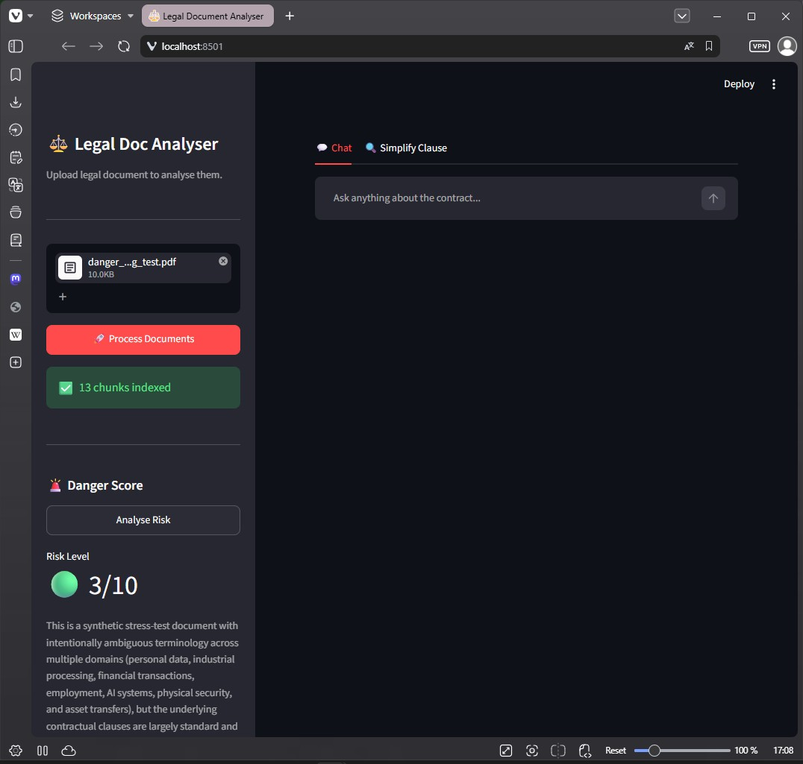

# legal-doc-rag-summarizer-v2-hybrid

> A hands on RAG tutorial for legal document analysis: this time going hybrid, pairing a local LLM with Claude.

🗓️ **Status: July 2026**

---

## Picture this

TODO: narrative intro, to be written together. Suggest a short scenario the reader can relate to (a wall of legal text, no easy way through it).

TODO: add a screenshot if available.

---

⚠️ **Heads up**

This is a personal learning project, not an official Anthropic resource.
It may contain errors, simplifications, or opinionated choices made for clarity over correctness.
Think of it as a **hands on RAG tutorial**: each part builds on the previous one, so you always know why the next step exists.

Before you dive in, keep a few things in mind:

1. **Fast Paced AI Evolution:** the AI landscape moves fast. Specific libraries or model names may change, but the RAG concepts taught here stay relevant.
2. **Not production ready:** this project was built to learn and teach. It has not been tested or hardened for production use.
3. **Built with AI Assistance:** this README was written with AI help, mainly for English refinement. The architecture, curriculum, and all technical decisions are my own.

This project is a sequel to [legal doc rag summarizer](TODO: link), which covered the fundamentals: chunking, embeddings, BM25, hybrid retrieval, danger score, and a Streamlit wrap up. This v2 picks up where that one left off and asks a new question: what happens when part of the pipeline runs locally instead of calling Claude for everything?

TODO: inspiration video credit.

---

# Key Concepts Demonstrated

TODO: finalize once parts 3 to 5 are locked in. Draft list:

✅ Merging CLI and Streamlit into a single entry point
<br>✅ Running a local LLM (llama3.2:1b) via Ollama
<br>✅ Spotting the limits of a small local model on generation tasks
<br>✅ Hybrid routing: local model for classification, Claude for generation
<br>✅ Single call vs decomposed call design tradeoffs
<br>✅ Calling Ollama directly over HTTP, from Python and from the browser

<a name="table-of-contents_"></a>

---

## Table of Contents

- [What is this project about?](#what-is-rag_)
- [Project Architecture](#project-architecture_)
- [Requirements](#requirements_)
- [Setup](#setup_)
- [Project Structure](#project-structure_)
- [Part 01 - One File, Two Audiences: Merging CLI and Streamlit](#part-1)
- [Part 02 - The Local Baseline: Meeting llama3.2:1b](#part-2)
- [Part 03 - One Call to Rule Them All](#part-3)
- [Part 04 - Divide and Conquer: Decomposing the Routing Logic](#part-4)
- [Part 05 - Talking to Ollama Directly](#part-5)
- [Next Steps & Resources](#next-steps--resources_)
- [Get in Touch](#get-in-touch_)

<a name="what-is-rag_"></a>

---

## What is this project about?

#### ⚡ Quick Navigation: [⬅️ Table of Contents](#table-of-contents_) | [Project Architecture ➡️](#project-architecture_)

This project has two audiences in mind.

**🔁 Coming from v1?**

You already have a working RAG pipeline that extracts text from a PDF, chunks it, searches it with vector and BM25 retrieval, and uses Claude for a danger score, a Q&A flow, and a clause simplifier. This sequel takes that pipeline and asks: 
- Could part of this run on a small local model instead, and where does that stop making sense?


**🆕 Starting here?**

Welcome. This project starts from an already working legal document assistant (the app you'll find in Part 01, `app_v9.py`) that gives a danger score, answers questions, and simplifies clauses using Claude. From there, you'll add a local model (llama3.2:1b, via Ollama), compare it against Claude, and end up with a hybrid system: the local model handles quick classification tasks, Claude handles the tasks that need strong reasoning.

<br>

> ⚠️ As mentioned earlier in this README, this is a learning project, not production ready software. It is meant to give you a hands on, working mental model of how hybrid RAG systems are actually built.

[↑ Back to Table of Contents](#table-of-contents_)

<a name="project-architecture_"></a>

---

## Project Architecture

#### ⚡ Quick Navigation: [⬅️ What is this project about?](#what-is-rag_) | [Requirements ➡️](#requirements_)

> TODO

[↑ Back to Table of Contents](#table-of-contents_)

<a name="requirements_"></a>

---

## Requirements

#### ⚡ Quick Navigation: [⬅️ Project Architecture](#project-architecture_) | [Setup ➡️](#setup_)

- Python 3.10+
- [Ollama](https://ollama.com) installed, with the `llama3.2:1b` model pulled

[↑ Back to Table of Contents](#table-of-contents_)

<a name="setup_"></a>

---

## Setup

#### ⚡ Quick Navigation: [⬅️ Requirements](#requirements_) | [Project Structure ➡️](#project-structure_)

### 1. Clone the repository

```bash
git clone https://github.com/hasff/legal-doc-rag-summarizer-v2-hybrid.git
cd legal-doc-rag-summarizer-v2-hybrid
```

### 2. Create a virtual environment

```bash
# Windows
py -m venv venv

# macOS / Linux
python -m venv venv
```

```bash
# Windows
venv\Scripts\activate

# macOS / Linux
source venv/bin/activate
```

### 3. Install dependencies

```bash
pip install -r requirements.txt
```

### 4. Configure environment variables

```bash
cp .env.example .env
```

Add your Anthropic API key to `.env`:

```
ANTHROPIC_API_KEY="your_key_here"
```

> ⚠️ Never commit your .env file. Add it to .gitignore.

[↑ Back to Table of Contents](#table-of-contents_)

<a name="project-structure_"></a>

---

## Project Structure

#### ⚡ Quick Navigation: [⬅️ Setup](#setup_) | [Part 01 ➡️](#part-1)

```
legal-doc-rag-summarizer-v2-hybrid/
├── .env.example
├── .gitignore
├── README.md
├── requirements.txt
│
├── app_v9.py           ← Part 01: merging CLI and Streamlit
├── app_v10.py          ← Part 02: local LLM baseline
├── app_v11.py          ← Part 03: single call routing (option A)
├── app_v12.py          ← Part 04: decomposed routing (option B)
├── app_v13.py          ← Part 05: direct HTTP calls to Ollama
├── ollama_demo.html    ← Part 05: browser demo
│
└── tos_docs/           ← place your PDF files here (git ignored)
```

[↑ Back to Table of Contents](#table-of-contents_)

<a name="part-1"></a>

---

# Part 01 - One File, Two Audiences: Merging CLI and Streamlit

#### ⚡ Quick Navigation: [⬅️ Project Structure](#project-structure_) | [Part 02 ➡️](#part-2)

> 📒 **What you'll learn:** how to merge a CLI test entry point and a Streamlit UI into a single file, and when `st.cache_resource` should (and should not) be used.

---

### Theory

**🔁 Coming from v1?** <br>
If you came from the first tutorial, you had `app_v7.py`, which had a `__main__` block for testing, and `app_v8.py`, which wrapped everything in a Streamlit UI without that test block. `app_v9.py` merges the two: one file that can run as a CLI test, or as a Streamlit app, depending on how it is launched.

**🆕 Starting here?** <br>
If you are new here: this app answers questions about a legal document, gives it a danger score, and rewrites confusing clauses in plain English. Part 01 is about the plumbing that lets you test that logic from the terminal and serve it through a Streamlit App, without duplicating code.

> 💡 Why one file instead of a separate `rag_core.py` module? More on that in the Code Walkthrough below.

---

### Code walkthrough

> 📄 **File:** `app_v9.py`

> ⚠️ Make sure you've installed the requirements and added your Anthropic API key to `.env`, as covered in [Setup ⬆️](#setup_). Without it, the Claude calls in this file won't work.

Note: `app_v9.py` is the result of merging `app_v7.py` and `app_v8.py`.

Before merging, `app_v7.py` had its own `__main__` block for CLI testing, and `app_v8.py` wrapped the same RAG logic in a Streamlit UI. <br>
The problem: Streamlit apps also run through `__main__`, so simply combining both files meant launching Streamlit would unintentionally trigger the CLI test block too.

`app_v9.py` solves this by merging both entry points into one file, while keeping the underlying RAG core untouched. The key decision is detecting whether the script is running inside the Streamlit server, using `streamlit.runtime.exists()`. When it returns `False`, the script runs in CLI test mode. When it returns `True`, it runs the Streamlit UI.

```python
# ─────────────────────────────────────────────
# 🚀 ENTRY POINT - RUN
# ─────────────────────────────────────────────
# `python app_v9.py`      -> runs CLI tests (like the old app_v7.py)
# `streamlit run app_v9.py` -> runs the Streamlit UI (like the old app_v8.py)
# streamlit.runtime.exists() tells these two cases apart, since Streamlit
# also sets __name__ == "__main__" internally.
if __name__ == "__main__":
    if st_runtime_exists(): # alias for streamlit.runtime.exists()
        run_streamlit_app() 
    else:
        run_cli_tests()
```

Where:
- `run_streamlit_app()`: runs all the logic related to streamlit 
- `run_cli_tests()`: runs the CLI tests

<br>

There's also another important adjustment.

**🔁 Coming from v1?** <br>
Back in `app_v8.py`, every Streamlit rerun reloaded the embeddings model from scratch. It wasn't a big deal then. We just wanted to see it working, so a bit of reload overhead went unnoticed. Here in `app_v9.py`, `@st.cache_resource` is introduced to fix that. The model now loads once and survives reruns.

**🆕 Starting here?** <br> 
Heavy, reusable resources such as the SentenceTransformer embeddings model are loaded through a function decorated with `@st.cache_resource`.


```python
@st.cache_resource
def get_embeddings_model():
    return SentenceTransformer("...")
```

Streamlit reruns the whole script on every interaction. Without caching, that would mean reloading model weights on every click, slow and unnecessary. `st.cache_resource` makes sure the model is created once per process and shared across sessions.

In practice, this means any function that needs the model just calls `get_embeddings_model()` again. Streamlit's caching returns the same instance instead of recreating it.

```python
def embed_texts(texts: list[str]) -> list[list[float]]:
    return get_embeddings_model().encode(texts).tolist()

def embed_query(query: str) -> list[float]:
    return get_embeddings_model().encode([query]).tolist()[0]
```

Worth noting: `st.cache_resource` works correctly even outside the Streamlit runtime, in plain CLI mode. So there is no need for conditional logic around `st_runtime_exists()` just to decide how the model gets loaded. The same cached function serves both modes.

The working rule used throughout this project:

| Kind of data | Where it lives |
|---|---|
| Heavy resources shared by everyone (models, clients) | `st.cache_resource` |
| Data generated from a specific user's input in a session (chunks, embeddings, BM25 index) | `st.session_state` |

> 💡 **A more honest architecture**
>
> The ideal setup would separate the core logic (chunking, embeddings, retrieval, Claude calls) into its own module, for example `rag_core.py`, with thin CLI and Streamlit files that just import from it. That respects separation of concerns and scales better for a real project.
>
> This tutorial deliberately keeps a single file per part instead, mainly so readers coming from v1 can follow the same one file per part pattern they already know. It is a conscious pedagogical tradeoff, not a claim that this is the "correct" way to structure a real app.

[⬆️ **`Part 1`**](#part-1)

---

### Run it

> On macOS / Linux, replace `py` with `python` or `python3`.

```bash
# CLI test mode
py app_v9.py

# Streamlit UI mode
streamlit run app_v9.py
```

Running the CLI mode loads the embeddings model once, then walks through the test cases: a danger score with summary, an `answer_question` call, and a `simplify_clause` call. Example output:

```bash
Score: 2
Summary: This is a synthetic test document designed to stress test retrieval systems...
===> answer_question
question: What the document is about?
answer: Based on the excerpts provided, this document is a synthetic legal document created for testing purposes only...
===> simplify_clause
clause: 3.3 Real Estate Agent Obligations...
answer: Plain English Version of Section 3.3...
```

Running `streamlit run app_v9.py` instead opens the same logic in a browser UI.


*app_v9.py running in Streamlit UI mode*

> Note: you'll notice the danger score differs slightly between the CLI run and the screenshot above (2 vs 3). LLMs are not deterministic, so small variations between runs are expected, even with the same input.

---

### Conclusions

`app_v9.py` merges the CLI test file and the Streamlit UI into one, using `streamlit.runtime.exists()` to tell the two run modes apart without conflicting `__main__` blocks. The RAG core itself didn't change.

We also introduced `@st.cache_resource`, which turned out to work the same whether the file runs as CLI or as Streamlit, so no extra conditional logic was needed there.

From here, we're ready to see how to run a local LLM and replace the Claude calls entirely. Is it worth the trouble? Let's see in the next part 👇.

---

> 💡 **Curiosity:** `llama3.2:1b` has around 1 billion parameters, small enough to run on a laptop CPU. For comparison, that is roughly 100 to 400 times smaller than most frontier cloud models. It is a useful reminder that "small" local models trade raw capability for speed and privacy, which is exactly the tension this project explores.

[↑ Back to Table of Contents](#table-of-contents_)

<a name="part-2"></a>

---

# Part 02 - The Local Baseline: Meeting llama3.2:1b

#### ⚡ Quick Navigation: [⬅️ Part 01](#part-1) | [Part 03 ➡️](#part-3)

> 📒 **What you'll learn:** how to call a local model through Ollama, and why that matters before building any routing logic on top of it.

---

### Theory

Before building anything clever, Part 02 sets a baseline: `ask_llm` calls `ask_local_llm`, which talks to `llama3.2:1b` through Ollama, directly, with no routing and no fallback to Claude. The point is to see, honestly, what a small local model can and cannot do on its own.

---

### Install dependencies

> 💡 This part introduces `ollama`. If you already ran `pip install -r requirements.txt`, you have it. If not:

```bash
pip install ollama
```

- `ollama` - the Python client used to talk to your local Ollama server.

You also need the model pulled locally:

```bash
ollama pull llama3.2:1b
```

---

### Code walkthrough

> 📄 **File:** `app_v10.py`

TODO: brief walkthrough of `ask_local_llm`.

---

### Run it

```bash
py app_v10.py
```

The test file runs three checks against the same document: a danger score, a direct question, and a clause simplification, using Claude and the local model side by side so you can compare them.

**Danger score**

Claude scored the document a 2, correctly recognizing it as a synthetic test document with no genuinely predatory clauses. The local model scored it a 4 and, instead of a summary grounded in the document, returned a generic list of clause types that do not match what danger scoring was asking for.

**Answering "What is the document about?"**

Claude gave an accurate, well organized answer, correctly identifying the document as a synthetic test file covering data protection, employee transfer, and agent conduct. The local model produced a plausible sounding but inaccurate answer, describing it as a straightforward Data Processing Agreement and missing that it is a synthetic, deliberately ambiguous test document.

**Simplifying a clause**

Claude rewrote the real estate agent clause clearly and stuck to what was actually in the text. The local model's rewrite drifted: it introduced details not present in the original clause (like contacting banks and lenders) and repeated large chunks of the source text instead of truly simplifying it.

---

### Conclusions

The pattern across all three tests is consistent: the local model is fluent, but not reliable, on generation tasks. It produces confident, well formatted answers that sound right and are wrong or invented in ways that matter for a legal context. That gap is the reason this tutorial moves toward a hybrid design instead of trying to push everything onto the local model.

---

> 💡 **Curiosity:** TODO

[↑ Back to Table of Contents](#table-of-contents_)

[⬆️ **`Part 2`**](#part-2)

<a name="part-3"></a>

---

# Part 03 - One Call to Rule Them All

#### ⚡ Quick Navigation: [⬅️ Part 02](#part-2) | [Part 04 ➡️](#part-4)

> 📒 **What you'll learn:** TODO

TODO: full section, to be written after testing `app_v11.py`. Draft notes: introduces `route_message`, a single JSON call to the local model that both classifies the relation to the document and simplifies the question at once. Marked in code as the "risky option": faster, but asking a 1B model to do two distinct tasks in one JSON response raises the odds of parsing failures and mixed up answers.

[↑ Back to Table of Contents](#table-of-contents_)

[⬆️ **`Part 3`**](#part-3)

<a name="part-4"></a>

---

# Part 04 - Divide and Conquer: Decomposing the Routing Logic

#### ⚡ Quick Navigation: [⬅️ Part 03](#part-3) | [Part 05 ➡️](#part-5)

> 📒 **What you'll learn:** TODO

TODO: full section, to be written after testing `app_v12.py`. Draft notes: introduces `check_relation` and `simplify_question` as two separate calls instead of one, the "decomposed option". `check_relation` returns a plain yes/no, no JSON. `simplify_question` only rewrites the question. Slower (two calls) but each function is simpler and more reliable. Key point: small local models are weak at generation but solid at binary classification, which makes them useful as guard rails before spending tokens on the expensive model.

[↑ Back to Table of Contents](#table-of-contents_)

[⬆️ **`Part 4`**](#part-4)

<a name="part-5"></a>

---

# Part 05 - Talking to Ollama Directly

#### ⚡ Quick Navigation: [⬅️ Part 04](#part-4) | [Next Steps ➡️](#next-steps--resources_)

> 📒 **What you'll learn:** TODO

TODO: full section, to be written after testing `app_v13.py`. Draft notes: replaces the Ollama Python client with plain HTTP requests in `ask_local_llm`. Includes a standalone HTML and JavaScript demo that talks to the local model straight from the browser, served with `python -m http.server 8000` to avoid CORS issues with `file://`.

[↑ Back to Table of Contents](#table-of-contents_)

[⬆️ **`Part 5`**](#part-5)

---

# 🎉 Project Complete! 😎

---

### In this project you built:

TODO: fill in once Parts 03 to 05 are settled.

| | |
|---|---|
| ✅ Merged CLI and Streamlit entry point | One file, tested from the terminal and served through a UI |
| ✅ Local LLM baseline | Called llama3.2:1b directly through Ollama, no routing |
| ✅ Single call routing | Classification and simplification in one JSON call |
| ✅ Decomposed routing | Same logic split into two simpler, more reliable calls |
| ✅ Direct HTTP calls | Talked to Ollama over plain requests, from Python and from the browser |

---

If you find this helpful and feel you learned something new, a ⭐ on the repo is more than enough thanks.

[↑ Back to Table of Contents](#table-of-contents_)

<a name="next-steps--resources_"></a>

---

## Next Steps & Resources

#### ⚡ Quick Navigation: [⬅️ Part 05](#part-5) | [Get in Touch ➡️](#get-in-touch_)

TODO: fill in once the rest of the project is done.

[↑ Back to Table of Contents](#table-of-contents_)

<a name="get-in-touch_"></a>

---

## 📬 Get in Touch

#### ⚡ Quick Navigation: [⬅️ Next Steps & Resources](#next-steps--resources_) | [⬆️ Back to Top](#legal-doc-rag-summarizer-v2-hybrid)

Found this useful? Have questions or ideas? I'd love to hear from you either way.

- 🔗 **[LinkedIn](https://www.linkedin.com/in/hugo-ferro-1434b414/)**
- 📩 **Email:** hugoferro (at) gmail.com

[↑ Back to Table of Contents](#table-of-contents_)
